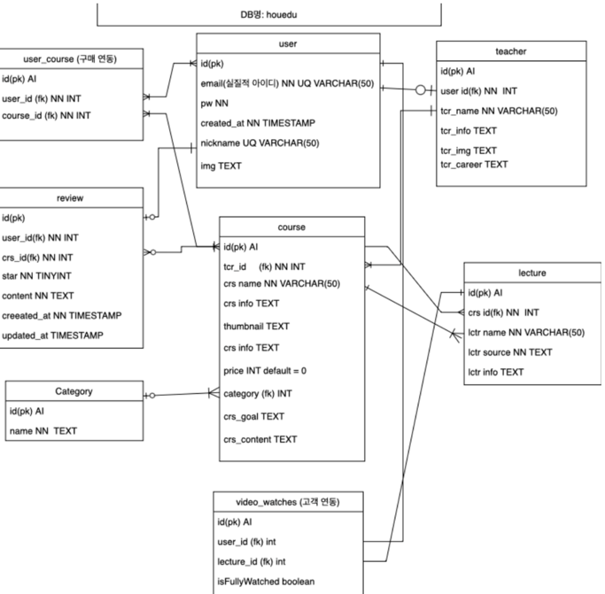
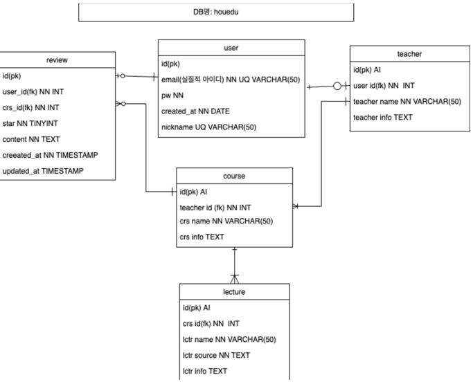
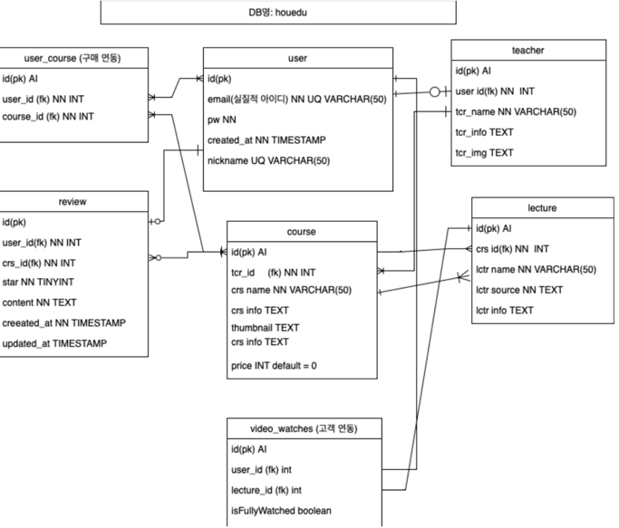
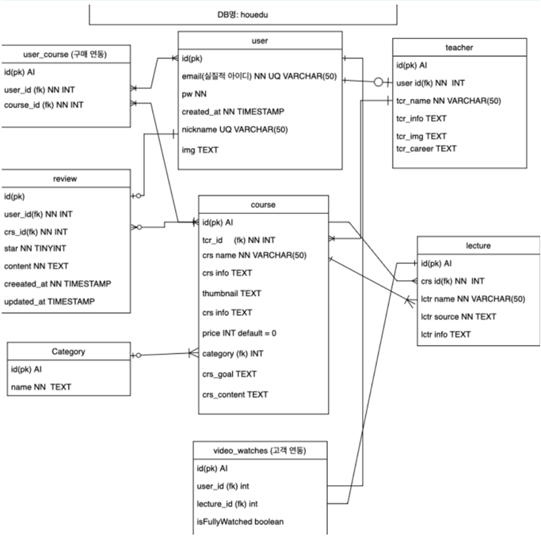

# HouEdu Project

### 목차


<hr>

## 프로젝트 요약
### 기간
2023.03.03 ~ 2023.03.29

### 기술 스택
- HTML 
- SCSS
- React
- Django
- Django Rest Framework
- uWSGI
- NGINX
- PHP
- Laravel
- Apache

### 협업 방식
- 피그마
- Git
- Slack
- Notion

### 팀원 역할 분담
이윤태(팀장)
- DB 설계 및 구현
- AWS(EC2, S3, RDS) 구축
- Django 서버 API 설계 및 구현
  - 로그인, 회원가입, 회원정보 수정, 비밀번호 수정
  - 강의 리스트, 강의 디테일
  - 리뷰 리스트, 리뷰 작성, 리뷰 삭제
- uWSGI, NGINX를 통한 서버 구축

임창섭
- 강의 리스트 페이지 구현
- 강의 디테일 페이지 구현

조다희
- Figma
- SCSS Base Setting
- 메인 페이지 구현
- 회원가입, 로그인, 카카오, Github 로그인 구현, 닉네임, 비밀번호 수정 페이지 구현
- 전체 리뷰 페이지 구현
- My 리뷰 페이지 구현
- axios api 연결

박정건
- DB 설계 및 구현
- AWS S3 스토리지 연동
- 강의실 프론트엔드/백엔드 개발

<hr>

<hr>

# 반장님들 팀 노션 페이지
[반장님들 팀 노션 페이지 링크](https://www.notion.so/deb717d82b634170ab7563cb0f6fd8c5)


# Database 구조

## 최종 DB



이번 프로젝트는 애자일(Agile) 프로세스로 진행되었습니다.

그래서 한 주기가 끝날때마다 DB 모델이 수정되었습니다.

---

## Version 1



가장 기초적으로 설계된 데이터베이스 입니다.

온라인 강의 웹 서비스에서 가장 핵심이라고 생각되는 user, 강사, course, lecture, 리뷰를 먼저 구현하였습니다.

여기서 ‘course’는 큰 분류의 강의이고, lecture는 큰 분류 강의(course)의 하위 강좌들입니다.

예를 들어 ‘인테리어 강의’는 ‘course’에 해당되고 ‘인테리어 강의 1강’, ‘인테리어 강의 2강’, … 와 같은 하위 강좌들은 ‘lecture’에 해당됩니다.

---

## Version 2



기본적인 기능을 구현한 이후, 설계된 데이터베이스입니다.

user의 구매 여부를 확인하는 ‘user_course’테이블과 유저가 강의를 시청했는지 여부를 확인하는 ‘video_watches’ 테이블이 추가되었습니다.

---

## Version 3



‘category’ 테이블이 추가 되고, ‘course’, ‘teacher’ 테이블의 컬럼들이 추가 되었습니다.

‘category’ 테이블을 추가해 카테고리별 분류 기능을 추가하였습니다.

‘course’와 ‘teacher’테이블에 기존에 있던 crs_info 컬럼처럼 기본적인 코스에 관한 정보뿐만 아니라 crs_goal(코스 목적), tcr_career(선생님 커리어) 등과 같은 추가적인 정보를 넣을 수 있는 컬럼을 추가했습니다. 

왜냐하면 저희가 구현하는 강의 디테일 페이지의 경우는 강의 정보를 하나의 이미지 파일로 넣는 일반적인 방식이 아닌, 직접 파트를 나눠 구현하다 보니, 상세 정보를 직접 다룰 필요가 있었습니다. 그래서 해당하는 데이터를 저장할 컬럼을 나누었습니다.

---

<hr>

# Django Model

User모델의 경우 django의 AbstractUser 기능을 이용하기 위해 django model을 활용해 테이블을 만들었고, User 모델을 migrate한 이후에 다른 테이블들은 MySQL 쿼리문을 이용해 생성되었습니다.

또한 모든 필드에 help_text 속성을 사용하고, docstring과 type hint를 통해 가독성을 높였습니다.

클래스에는 One-Line Docstring을 적용하였고, method에는 Multi-Line Docstring을 적용했고 그 중에서도 Sphinx Style을 적용하였습니다.

## 세팅

> settings.py
> 

```python
DATABASES = {
    "default": {
        "ENGINE": "django.db.backends.mysql",
        "NAME": "houedu_v2",
        "USER": "admin",
        "PASSWORD": env("DATABASE_PWD"),
        "HOST": env("DATABASE_HOST"),
        "PORT": "3306",
        "OPTIONS": {"init_command": "SET sql_mode='STRICT_ALL_TABLES'"},
    }
}
```

**DATABASE** : 데이터 베이스 연결에 대한 세부 정보를 dictionary 타입으로 저장

**ENGINE** : 연결에 사용할 데이터베이스 엔진 지정. 이 경우는 MySQL

**PASSWORD** : db 비밀번호, 이 경우는 env() 함수를 통해서 환경 변수의 값을 검색하도록 처리.

**"init_command": "SET sql_mode='STRICT_ALL_TABLES'"**

- “init_command” 옵션은 SQL 모드를 “STRICT_ALL_TABLES” 로 설정했습니다.
- “init_command” 옵션은 DB 연결이 설정된 직후 실행되어야 하는 명령을 지정하는 데 사용됩니다.
- sql_mode는 DB가 SQL 구문 및 데이터 유효성 검사를 처리하는 방법을 지정하는 데 사용됩니다.
- ‘STRICT_ALL_TABLES’ : MySQL이 데이터베이스 테이블에 데이터를 삽입하거나 업데이트할 때 더 엄격한 유효성 검사 규칙을 적용
예를 들어 2월 31일 과 같은 유효하지 않은 날짜 거부 등 테이블에 대해 지정된 유효성 검사 규칙을 위반하는 경우 값을 거부합니다.
- **이렇게 옵션을 지정하면 DB에 올바르지 않은 데이터나 유효하지 않은 데이터가 삽입되거나 업데이트 되어 데이터가 손상되는 것을 방지할 수 있습니다.**

## Users Model

> users/models.py class User

```python
class User(AbstractUser):
    """
    사용자를 나타내는 모델
    """

    first_name: Text = models.CharField(
        max_length=150,
        editable=False,
    )
    last_name: Text = models.CharField(
        max_length=150,
        editable=False,
    )
    nickname: Optional[Text] = models.CharField(
        unique=True,
        max_length=50,
        blank=True,
        null=True,
        help_text="닉네임 필드",
    )
    email: Text = models.EmailField(
        blank=False,
        unique=True,
        help_text="이메일 필드",
    )
    user_img: Optional[Text] = models.TextField(
        blank=True,
        null=True,
        help_text="사용자 이미지 URL 필드",
    )

    class Meta:
        db_table = "user"

    def __str__(self) -> Text:
        """
        사용자의 문자열 표현 반환

        :return: 사용자 문자열
        """
        return f"{str(self.id)} {self.nickname}"
```

User 모델은 AbstractUser 모델을 상속받아 구현하였습니다. AbstractUser 클래스를 상속함으로써 Django의 인증 시스템에 내장된 암호 해싱 등과 같은 내장 보안 기능을 직접 구현하지 않고 활용할 수 있었습니다.

first_name과 last_name은 editable 속성을 False로 설정해 직접적인 편집을 할 수 없도록 처리하였습니다.

email, nickname 필드는 unique=True 제약 조건을 걸어 고유한 값이 되도록 하였습니다.

Meta 클래스의 db_table 옵션을 지정해서 테이블 명을 장고에서 정해주는 테이블 명이 아닌 제가 지정한 테이블 명을 사용했습니다. 

### Meta 클래스 관련해서 작성한 글

[Django Model에서의 Meta 클래스](https://yesaroun.tistory.com/entry/Django-Model에서의-Meta-클래스)

### users/models.py 코드 전문

```python
from django.db import models
from django.contrib.auth.models import AbstractUser
from typing import Optional, Text

class User(AbstractUser):
    """
    사용자를 나타내는 모델
    """

    first_name: Text = models.CharField(
        max_length=150,
        editable=False,
    )
    last_name: Text = models.CharField(
        max_length=150,
        editable=False,
    )
    nickname: Optional[Text] = models.CharField(
        unique=True,
        max_length=50,
        blank=True,
        null=True,
        help_text="닉네임 필드",
    )
    email: Text = models.EmailField(
        blank=False,
        unique=True,
        help_text="이메일 필드",
    )
    user_img: Optional[Text] = models.TextField(
        blank=True,
        null=True,
        help_text="사용자 이미지 URL 필드",
    )

    class Meta:
        db_table = "user"

    def __str__(self) -> Text:
        """
        사용자의 문자열 표현 반환

        :return: 사용자 문자열
        """
        return f"{str(self.id)} {self.nickname}"

class Teacher(models.Model):
    """
    강사를 나타내는 모델
    """

    user: User = models.OneToOneField(
        User,
        models.DO_NOTHING,
        blank=True,
        null=True,
        related_name="teachers",
        help_text="강사인 유저, 1대1관계",
    )
    tcr_name: Text = models.CharField(
        max_length=50,
        help_text="강사 이름 필드",
    )
    tcr_info: Optional[Text] = models.TextField(
        blank=True,
        null=True,
        help_text="강사 정보 필드",
    )
    tcr_img: Optional[Text] = models.TextField(
        blank=True,
        null=True,
        help_text="강사 이미지 URL 필드",
    )
    tcr_career: Optional[Text] = models.TextField(
        blank=True,
        null=True,
        help_text="강사 경력 필드",
    )

    class Meta:
        managed = True
        db_table = "teacher"

    def __str__(self) -> Text:
        """
        강사 이름 반환

        :return: 강사 이름
        """
        return self.tcr_name

class UserCourse(models.Model):
    """
    사용자가 수강한 강의들을 나타내는 모델
    """

    user: User = models.ForeignKey(
        User,
        models.DO_NOTHING,
        related_name="userCourses",
        help_text="강의를 수강한 사용자 필드",
    )
    course = models.ForeignKey(
        "courses.Course",
        models.DO_NOTHING,
        related_name="userCourses",
        help_text="수강한 강의 필드",
    )

    class Meta:
        managed = True
        db_table = "user_course"

class VideoWatches(models.Model):
    """
    사용자가 시청한 동영상들을 나타내는 모델
    """

    user: Optional[User] = models.ForeignKey(
        User,
        models.DO_NOTHING,
        blank=True,
        null=True,
        related_name="videoWatches",
        help_text="시청한 유저 필드",
    )
    lecture = models.ForeignKey(
        "courses.Lecture",
        models.DO_NOTHING,
        blank=True,
        null=True,
        related_name="videoWatches",
        help_text="시청한 강좌 필드",
    )
    isfullywatched: Optional[bool] = models.BooleanField(
        db_column="isFullyWatched",
        blank=True,
        null=True,
        help_text="시청 여부 필드",
    )

    class Meta:
        managed = True
        db_table = "video_watches"
        verbose_name_plural = "Video Watches"
```

다른 클래스들은 User 클래스와 비슷하며, 
조금 다른 점은 Meta 클래스의 옵션으로 ‘managed’를 사용해서 mysql 테이블을 직접 수정할 수있게 하였고, ‘verbose_name_plural’ 옵션을 추가해 장고 admin에서 확인할 수 있는 복수 명을 지정하였습니다.

- Teacher 클래스 : User의 계정이면서 추가적으로 Teacher 계정 정보를 갖을 수 있도록, user의 id를 FK로 갖습니다.
- UserCourse 클래스 : 수강 신청을 누르면 


## UserCourse Model

```python
class UserCourse(models.Model):
    """
    사용자가 수강한 강의들을 나타내는 모델
    """

    user: User = models.ForeignKey(
        User,
        models.DO_NOTHING,
        related_name="userCourses",
        help_text="강의를 수강한 사용자 필드",
    )
    course = models.ForeignKey(
        "courses.Course",
        models.DO_NOTHING,
        related_name="userCourses",
        help_text="수강한 강의 필드",
    )

    class Meta:
        managed = True
        db_table = "user_course"
```

<hr>

# API 설계 및 구조

## test